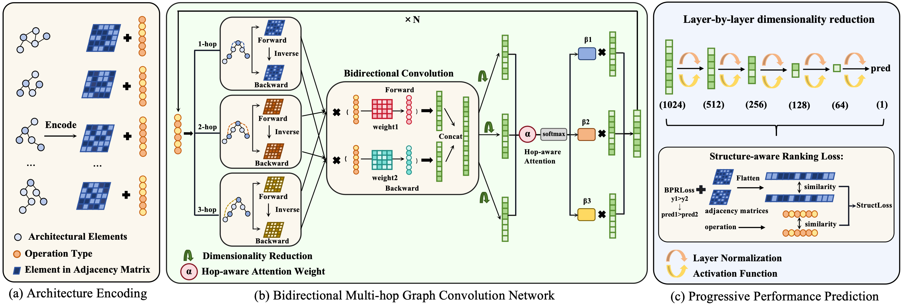

# BMSR：A Bidirectional Multi-hop Predictor with Structure-aware Ranking for NAS
The implementation for BMSR：A Bidirectional Multi-hop Predictor with Structure-aware Ranking for NAS

## Requirements
```
- python == 3.8.20 
- pytorch == 2.4.1
- torchvision == 0.19.1
- scipy == 1.10.1
- nasbench == 1.0
- nas_201_api == 2.1
```
##Dataset Preparation
This project uses three datasets: NAS-Bench-101, NAS-Bench-201, and DARTS.
**NAS-Bench-101**
Project: https://github.com/google-research/nasbench
Dataset: https://storage.googleapis.com/nasbench/nasbench_only108.tfrecord

After downloading, place the dataset under: “NAS-Bench-101/path”.
Then simply run “NAS-Bench-101/main.py”, which will automatically generate the preprocessed data file:“tiny_nas_bench_101_test.pkl before training”.
